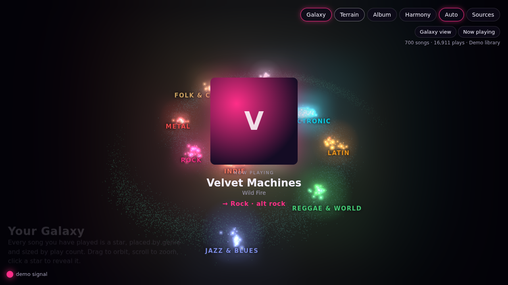
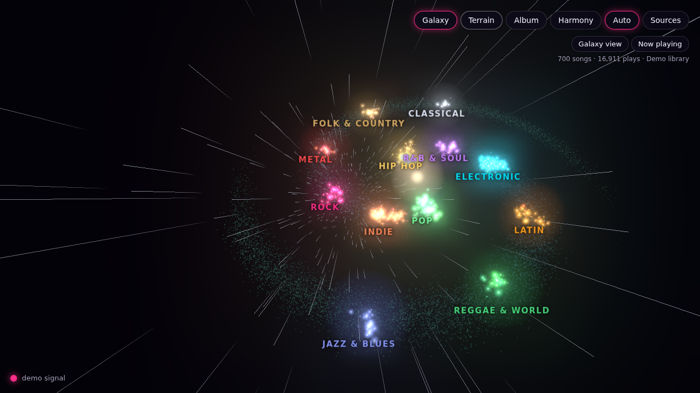
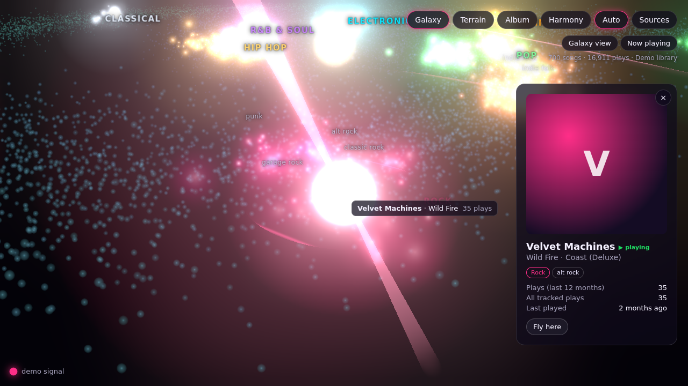
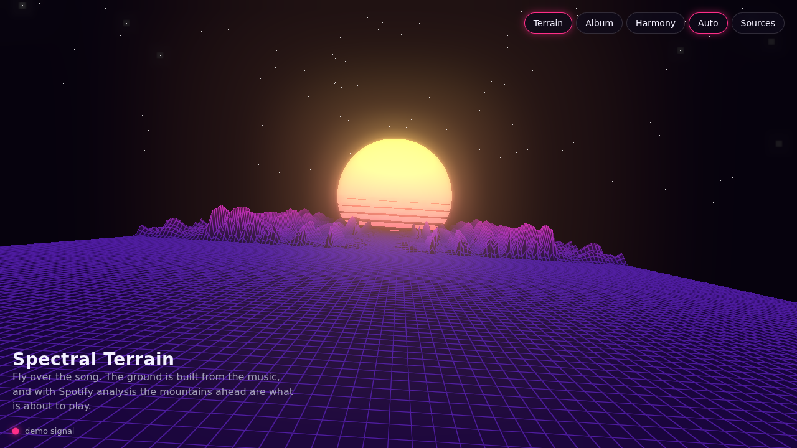
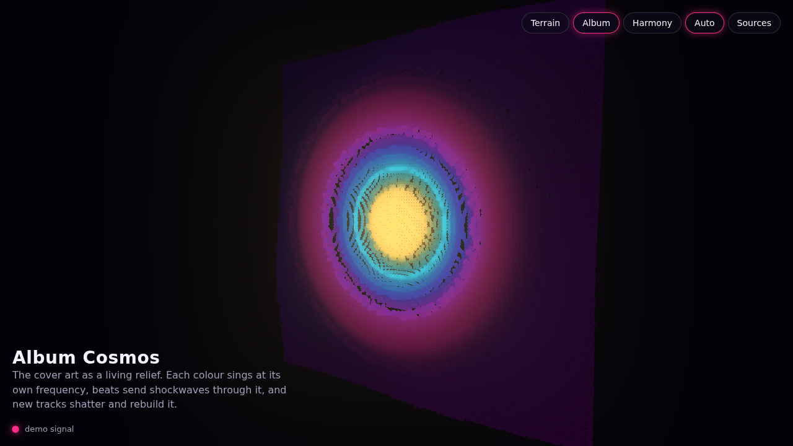
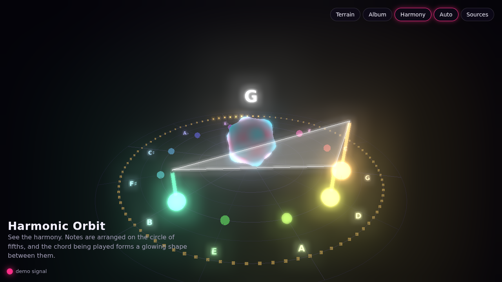
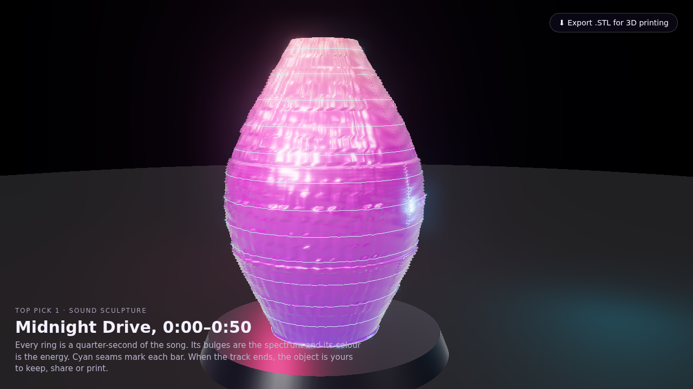
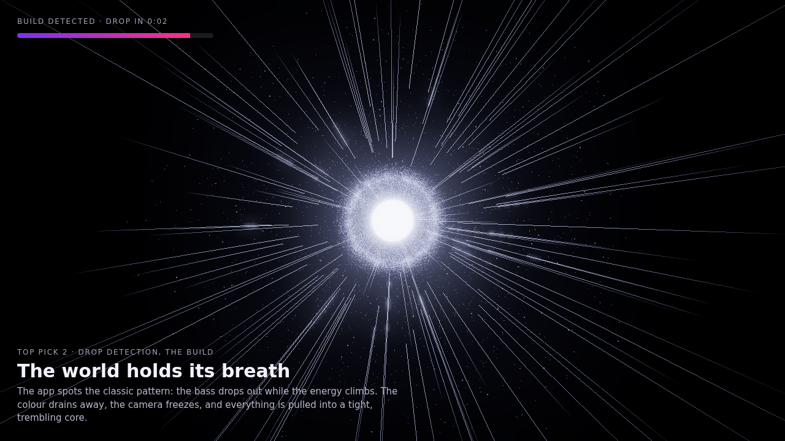
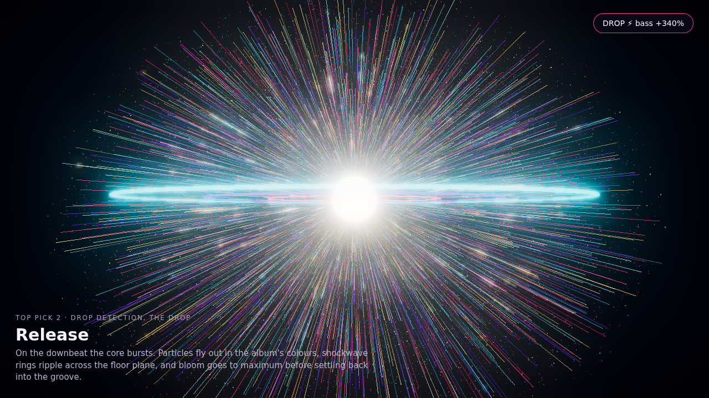
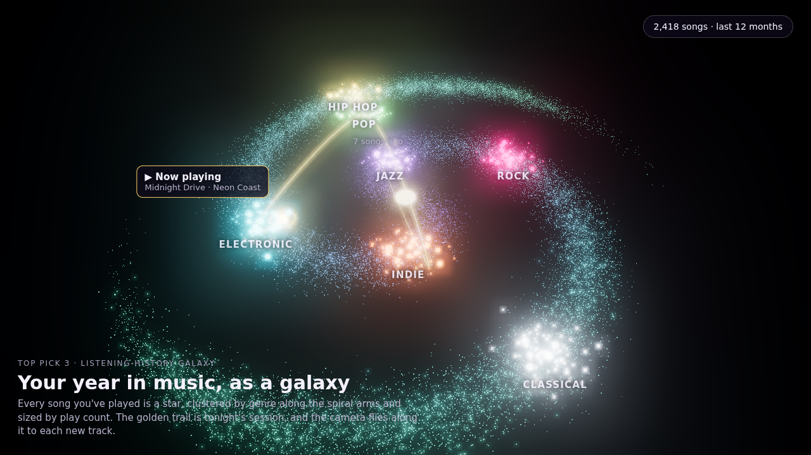

# Spotify 3D Visualiser

A three.js music visualiser that connects to your Spotify account. It needs no build step and no backend: it's static HTML plus ES modules.

## Your Galaxy (main scene)

| Launch | Warp | Pulsar + song card |
| --- | --- | --- |
|  |  |  |

Your listening history as a galaxy you can fly around:

- **Every song is a star.** Its **position is its genre**: twelve constellations along the spiral arms (Electronic, Indie, Hip hop…), with micro-genres ("uk garage", "neo soul") as sub-clusters inside them. Its **size is your play count**. Songs whose genre isn't known yet sit in the Uncharted rim, then glide home once Spotify tells us the artist's genres.
- **Explore:** drag to orbit, scroll to zoom (micro-genre labels appear as you get close), hover for a tooltip, click for the song card (art, genres, plays, last played, top-track rank, Open in Spotify), and double-click to fly there. Switch between 4 weeks, 6 months, 12 months and all time.
- **When a song starts** its card is shown, then the camera accelerates through warp to that song's star.
- **On arrival the star becomes a pulsar.** Its beams spin with the tempo (half a turn per beat). Every *sudden jump* in loudness (short-term energy vs. the recent trend) fires a ring whose size, speed and brightness scale with the jump. Kicks make small ripples; a drop sends a shockwave across the galaxy that lights up every star it passes.

### Where the play counts come from

Spotify's API has **no play counts**, so the app keeps its own history in the browser (IndexedDB):

| Source | What it gives |
| --- | --- |
| Live | A play is counted while the page is open, once 30 s (or half a short track) has been heard |
| Recently played | Spotify's last 50 plays, synced at launch and every 10 min to fill gaps |
| Top tracks | Your top 50 for 4 weeks, 6 months and ~1 year. They seed the galaxy on day one (sized by rank until real plays are counted) |
| Streaming-history import | Request **Extended streaming history** at [spotify.com/account/privacy](https://www.spotify.com/account/privacy/) (it takes a few days), then import the JSON files under Sources. This gives years of plays at once |

The same listen is never counted twice across sources. History stays in that browser. For tracking while the page is closed, the next step would be a small server that polls recently-played every hour.

Note that Spotify's February 2026 development-mode changes removed the batch endpoints, so artists are looked up one at a time (cached, most-played first, respecting rate limits). Development-mode apps also need the owner to have Premium and allow up to 5 users.

## Other scenes

| Spectral Terrain | Album Cosmos | Harmonic Orbit |
| --- | --- | --- |
|  |  |  |

## Run it

```bash
cd spotify-visualiser
python3 -m http.server 8888 --bind 127.0.0.1
# open http://127.0.0.1:8888/
```

Click **Just show me the demo** to see it straight away with a synthetic song and a made-up 700-song library.

### Connect Spotify

1. Create an app at <https://developer.spotify.com/dashboard> and choose "Web API".
2. Add the redirect URI `http://127.0.0.1:8888/`. Spotify no longer accepts `localhost`; use the loopback IP or HTTPS.
3. While the app is in development mode, add your Spotify account under **User Management**.
4. Paste the Client ID into the Sources panel and click **Connect**. Login uses PKCE, so no client secret is needed. If you connected before the Galaxy existed, disconnect and reconnect once so the app can read your top tracks and recent plays.

### Add live audio (recommended)

Spotify streams are DRM-protected, so no web page can read the audio. The visualiser therefore uses Spotify for *what* is playing and listens to the sound separately:

- **Capture tab / system audio**: play Spotify at open.spotify.com in another Chrome/Edge tab, click Capture, pick that tab and tick "Share tab audio". This gives the best fidelity with zero latency.
- **Microphone**: works with any speaker, including your phone or a hi-fi.
- **Local file**: drop in an audio file.

## How it works

```
Spotify API ──► track, artwork ──► palette + particle art
            ──► playback clock ─┐
            ──► audio-analysis ─┴► AnalysisSource ─┐
Live audio  ──► FFT ──────────────► LiveSource ────┼─► frame {spectrum, bass/mid/treble,
Nothing     ──────────────────────► DemoSource ────┘    beat/bar pulses, chroma, sections}
                                                             │
                                          Terrain · Album · Harmonic scenes + bloom
```

Every source writes into the same `frame`, so the scenes don't care where the data came from. *Timeline* sources (Spotify analysis and the demo) can also answer "what will the spectrum be at time *t*?", which the terrain uses to show the future.

> **Note on audio-analysis:** Spotify restricted `audio-analysis` and `audio-features` for apps created after 27 Nov 2024. The app tries it once, and on a 403 falls back to live audio. Older apps, or apps with extended quota access, get exact beat, bar and section sync.

## What makes it different from a normal visualiser

Most visualisers are a 2D bar graph or a pulsing circle, reacting only to loudness *right now*. This one uses the third dimension for **time**, **harmony** and **the album itself**:

1. **The song as a place (Spectral Terrain).** Spectrum history becomes geography. Bass forms the valley walls you fly through and treble forms the distant peaks. With analysis data, rows are sampled ~6.6 s ahead of playback, so **the mountains on the horizon are the music that's about to play**. You see the drop coming before you hear it.
2. **Seeing harmony, not just volume (Harmonic Orbit).** Pitch classes stand on the circle of fifths, so related keys sit next to each other. The strongest notes form a glowing chord shape that is named live ("Am", "G"). Major and minor triads are mirror-image triangles, so key changes and chord progressions become *shapes you can recognise*.
3. **The album cover comes alive (Album Cosmos).** The cover is rebuilt from 16k particles as a relief sculpture. Each pixel reacts to the frequency matching its colour: reds pump with the kick and blues shimmer with the hi-hats. Beats send shockwaves across the art, and on a track change the cover shatters into a nebula and re-forms as the next one.
4. **Song structure drives the camera and the scene.** Scenes switch automatically on section changes (verse → chorus). The camera breathes on bars and pushes in on beats, and the terrain fly-over rolls gently. It feels directed rather than twitchy.
5. **The whole world takes its colour from the artwork.** Each track's palette is extracted from its cover and pushed toward neon for bloom, so every album gets its own lighting.

### Concept renders (not built yet)

| Sound Sculpture | Drop: the build | Drop: the release | Listening-History Galaxy |
| --- | --- | --- | --- |
|  |  |  |  |

### More ideas to build next

- **Walk-through playlist**: each track is a room or planet in a 3D gallery, laid out by the playlist's harmonic key and tempo.
- **Lyrics in space**: synced lyrics (e.g. LRCLIB) as 3D type flying past the terrain on the beat.
- **Stereo field**: split the L/R channels so instruments sit left or right in 3D space.
- **Timbre creatures**: Spotify's 12-D timbre vectors drive the shape of a morphing organism.
- **WebXR mode**: stand inside the Harmonic Orbit in a VR headset.
- **Shared rooms**: friends' "now playing" as orbiting moons, via a small WebSocket relay.

## Controls

`1`–`4` scenes · `←`/`→` or `Space` cycle · `A` auto-switch on sections (the Galaxy stays put) · `H` hide HUD · `F` fullscreen · `Esc` close song card

## Files

```
index.html, style.css     UI shell; three.js is loaded from jsDelivr through an import map
src/main.js               renderer, bloom, source selection, Spotify polling, HUD
src/spotify.js            PKCE auth and Web API client
src/history.js            IndexedDB play history: live, recently-played, top tracks, import
src/genres.js             micro-genre → constellation rules and deterministic star layout
src/audio.js              LiveSource (FFT, onsets, chroma), AnalysisSource, DemoSource
src/palette.js            album-art palette and pixel extraction
src/scenes/*.js           galaxy, terrain, album, harmonic
```
